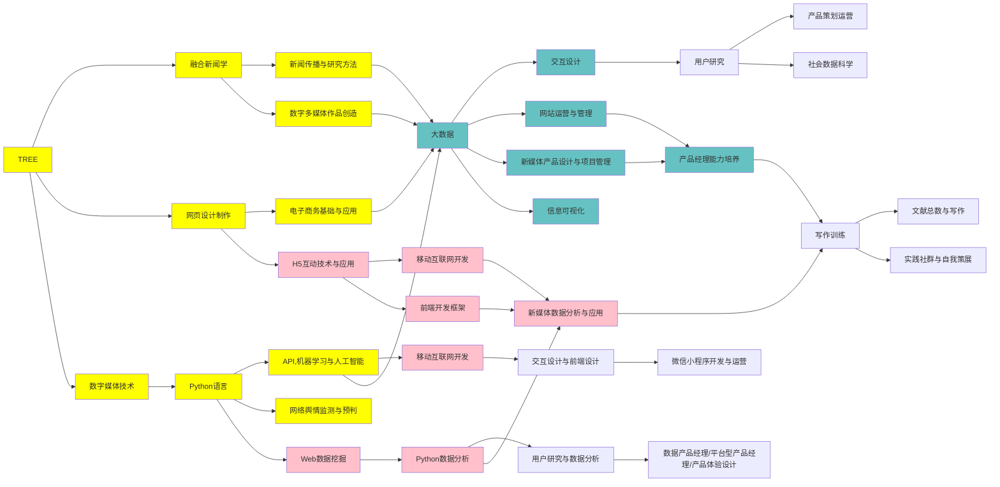

----

* 课程：数字媒体技术（11周2课）
* 记录人：叶倩
* 时间：2021年11月10日
* week 11

---
### **<Typora>**
> 1. typora介绍
>> 1. [typora官网下载](https://typora.io/)
>> 2. [typora进阶](https://www.bilibili.com/video/BV12T4y1g7se?from=search&seid=1073155979321395137&spm_id_from=333.337.0.0)

>
>```html
>print("hello world")
>```
>
>```html
><html lang="en">
><head>
>	<meta charset="UTF-8">
>	<meta name="viewport" content="width=device-width, initial-scale=1.0, maximum-scale=1.0, user-scalable=0">
>	<title>INFINI | 映纷创意</title>
>	<link rel="stylesheet" href="/Public/home/css/layout.css">
>	<link rel="stylesheet" href="/Public/home/css/main.css">
>	<link rel="stylesheet" type="text/css" href="/Public/home/css/idangerous.swiper.css">
>	<link rel="shortcut icon" href="/favicon.ico" />
>	<link rel="bookmark"href="/favicon.ico" />
></head>
><body>
>    
></body>
>```
>
>---
>
>*2.流程图*
>
>```mermaid
>graph TB
>A[Apple]-->B[body]
>A---C(Cat)
>B.->D((Dog))
>C==喵==>D
>style A fill:#2ff,fill-opacity:0.5,stroke:#faa,stroke-width:5px
>style D stroke:#0999,stroke-width:5px
>```
>
>---
>
>

----

>>实践1：Flowchart流程图
>
>>实践2：网新专业培养方案
>
>
>
>3.甘特图
>
>```mermaid
>gantt
>dateFormat YYYY-MM-DD
>TITLE 产品计划表
>section 阶段一
>产品原型图:crit, 2021-11-10,2021-11-20
>section 阶段二
>产品交互界面:2021-11-21,2021-11-30
>section 阶段三 
>产品成型:2022-1-10,2022-2-10
>
>```
>




